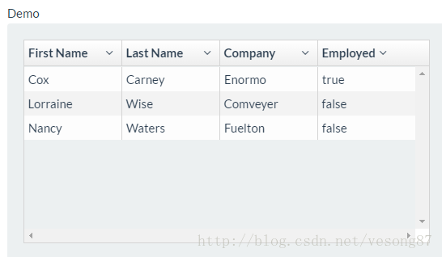

原文：[101 intro to UI-Grid](http://ui-grid.info/docs/#/tutorial/101_intro)

UI-Grid 3.0 (原 ng-grid)是一个不依赖于其他AngularJS，完全独立的 angular 表格系统。它围绕表格的核心设计模块和功能，功能的分层就像是angular的模型和指令。这些让它的核心代码小而精，并且能让你使用它来实现复杂的功能。

在核心模块中，可以获得： 
- 虚拟的行和列，视图中可见的行和列才会显示 
- 绑定单元格一系列属性和方法 
- 列的排序有三种状态：Asc, Desc, None 
- 列的过滤 
- 使用自定义模板更改页眉和单元格内容 
- i18nService 允许标记翻译

在这个例子中，我们创建了最基本的表格。 
方法如下：

- 引入uiGrid的js和css
```angular2html
<link rel="styleSheet" href="release/ui-grid.min.css"/>
<script src="http://ajax.googleapis.com/ajax/libs/angularjs/1.3.16/angular.min.js"></script>
<script src="/release/ui-grid.min.js"></script>
```

- 依赖注入
```angular2html
var app = angular.module('app', ['ui.grid']);
```

- 或者使用
```angular2html
var app = angular.module('app', [require('angular-ui-grid')]);
```

- 添加css样式
```angular2html
.myGrid {
    width: 500px;
    height: 250px;
  }
```

- $scope中添加数组对象

```angular2html
$scope.myData = [
        {
            "firstName": "Cox",
            "lastName": "Carney"...
```

- 使用ui-grid指令并指定json数据到引用的data属性上
```angular2html
<div ng-controller="MainCtrl">
  <div ui-grid="{ data: myData }" class="myGrid"></div>
</div>
```

index.html
```angular2html
<!doctype html>
<html ng-app="app">
  <head>
    <script src="http://ajax.googleapis.com/ajax/libs/angularjs/1.5.0/angular.js"></script>
    <script src="http://ajax.googleapis.com/ajax/libs/angularjs/1.5.0/angular-touch.js"></script>
    <script src="http://ajax.googleapis.com/ajax/libs/angularjs/1.5.0/angular-animate.js"></script>
    <script src="http://ui-grid.info/docs/grunt-scripts/csv.js"></script>
    <script src="http://ui-grid.info/docs/grunt-scripts/pdfmake.js"></script>
    <script src="http://ui-grid.info/docs/grunt-scripts/vfs_fonts.js"></script>
    <script src="/release/ui-grid.js"></script>
    <script src="/release/ui-grid.css"></script>
    <script src="app.js"></script>
  </head>
  <body>
    <div ng-controller="MainCtrl">
      <div id="grid1" ui-grid="{ data: myData }" class="grid"></div>
    </div>
  </body>
</html>
```

main.css

```angular2html
.grid {
  width: 500px;
  height: 250px;
}
```

app.js

```angular2html
var app = angular.module('app', ['ngTouch', 'ui.grid']);

app.controller('MainCtrl', ['$scope', function ($scope) {

  $scope.myData = [
    {
        "firstName": "Cox",
        "lastName": "Carney",
        "company": "Enormo",
        "employed": true
    },
    {
        "firstName": "Lorraine",
        "lastName": "Wise",
        "company": "Comveyer",
        "employed": false
    },
    {
        "firstName": "Nancy",
        "lastName": "Waters",
        "company": "Fuelton",
        "employed": false
    }
];
}]);
```
