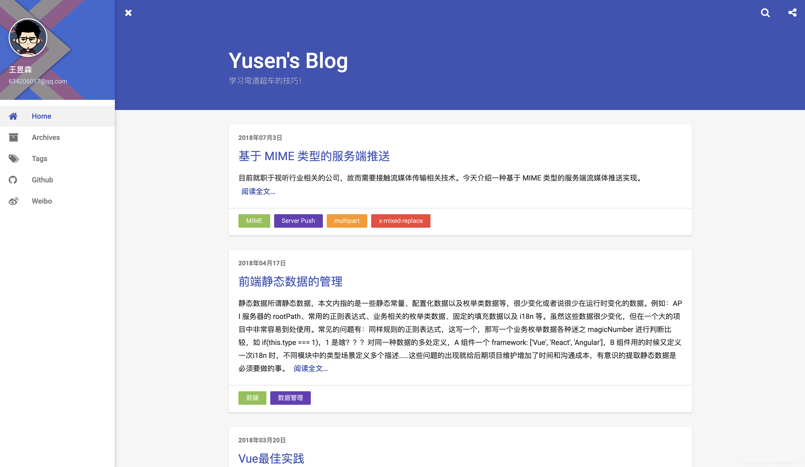
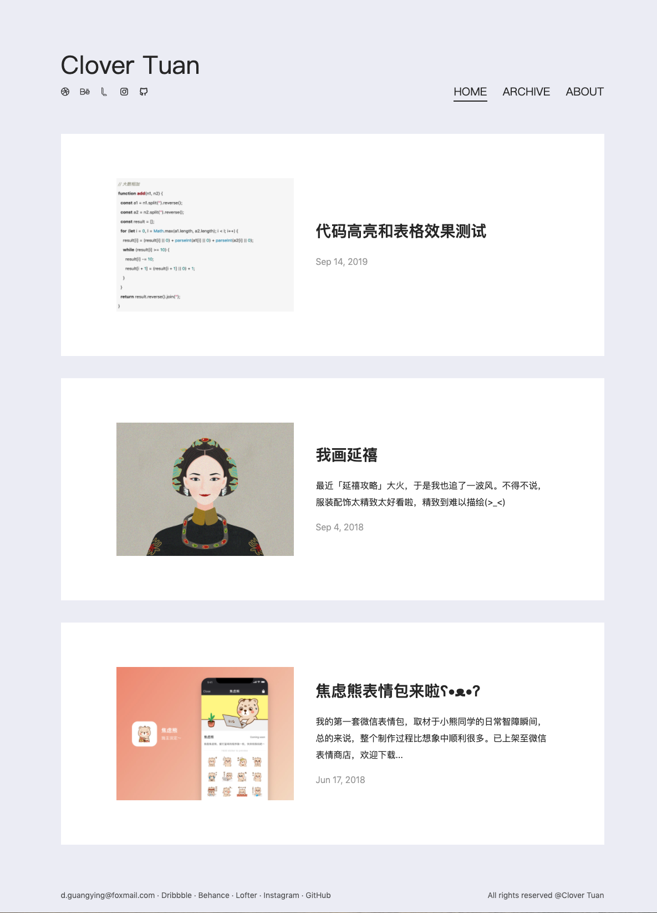
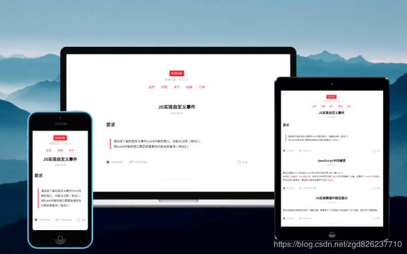
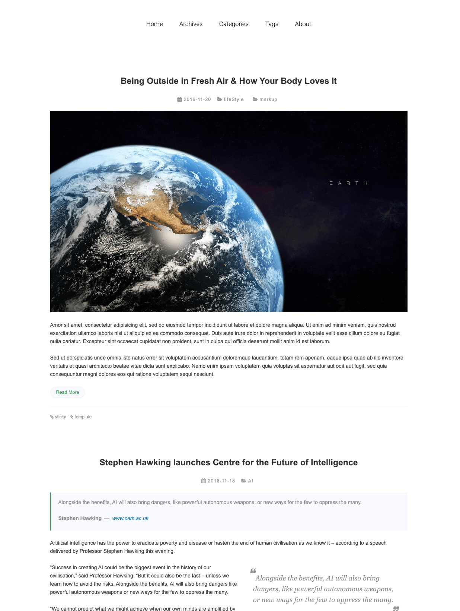
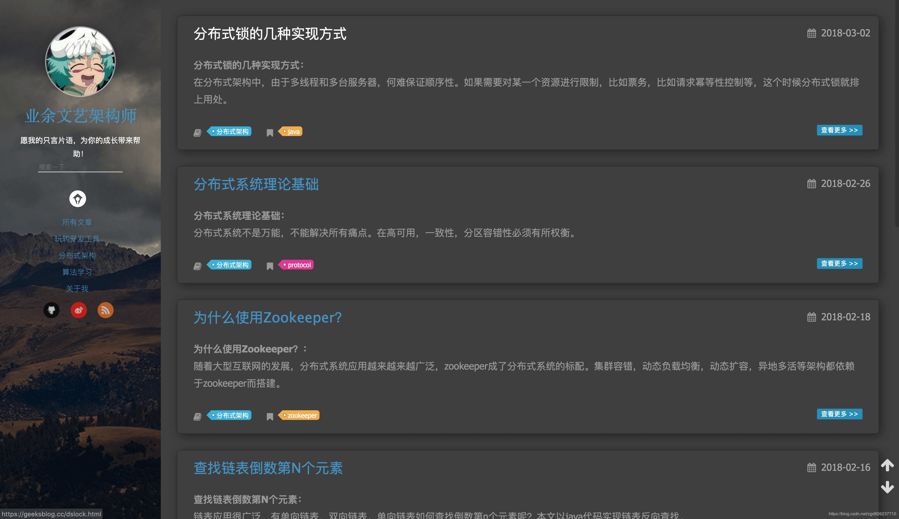
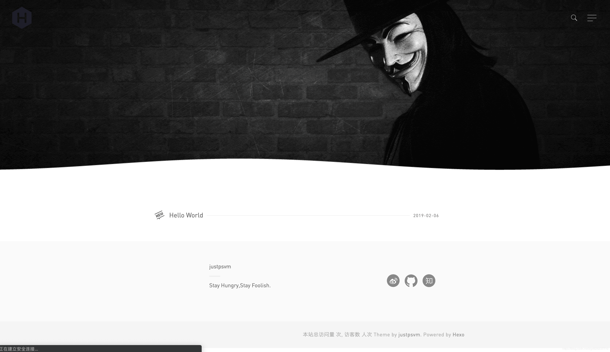
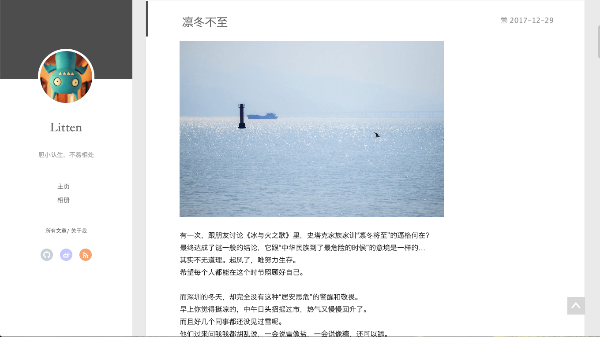

## 目录

* [Indigo](#Indigo)
* [Butterfly](#Butterfly)
* [Pure](#Pure)
* [Melody](#Melody)
* [Nexmoe](#Nexmoe)
* [Clover](#Clover)
* [Diaspora](#Diaspora)
* [Hacker](#Hacker)
* [Hiker](#Hiker)
* [black-blue](#black-blue)
* [Cube](#Cube)
* [Varaint](#Varaint)
* [yilia](#yilia)

## [Indigo](#Indigo)

* [预览地址](https://www.imys.net/)
* [GitHub 项目地址](https://github.com/yscoder/hexo-theme-indigo)
* [安装教程](https://github.com/yscoder/hexo-theme-indigo/wiki)
* 效果图：

## [Butterfly](#Butterfly)

* [预览地址](https://jerryc.me/)
* [GitHub 项目地址](https://github.com/jerryc127/hexo-theme-butterfly)
* [安装教程](https://jerryc.me/posts/21cfbf15/)
* 效果图：

## [Pure](#Pure)

* [预览地址](https://blog.cofess.com/)
* [GitHub 项目地址](https://github.com/cofess/hexo-theme-pure)
* [安装教程](https://blog.cofess.com/2017/11/01/hexo-blog-theme-pure-usage-description.html)
* 效果图：

## [Melody](#Melody)

* [预览地址](https://molunerfinn.com/)
* [GitHub 项目地址](https://github.com/Molunerfinn/hexo-theme-melody)
* [安装教程](https://github.com/Molunerfinn/hexo-theme-melody)
* 效果图：

## [Nexmoe](#Nexmoe)

* [预览地址](https://nexmoe.com/)
* [GitHub 项目地址](https://github.com/nexmoe/hexo-theme-nexmoe)
* [安装教程](https://nexmoe.com/hexo-theme-nexmoe.html)
* 效果图：

## [Clover](#Clover)

* [预览地址](https://esappear.github.io/clover/)
* [GitHub 项目地址](https://github.com/esappear/hexo-theme-clover)
* [安装教程](https://github.com/esappear/hexo-theme-clover)
* 效果图：

## [Diaspora](#Diaspora)

* [预览地址](https://fech.in/)
* [GitHub 项目地址](https://github.com/Fechin/hexo-theme-diaspora)
* [安装教程](https://github.com/Fechin/hexo-theme-diaspora)
* 效果图：

## [Hacker](#Hacker)

* [预览地址](https://blog.daraw.cn/)
* [GitHub 项目地址](https://github.com/CodeDaraW/Hacker)
* [安装教程](https://github.com/CodeDaraW/Hacker)
* 效果图：

## [Hiker](#Hiker)

* [预览地址](https://itimetraveler.github.io/hexo-theme-hiker/)
* [GitHub 项目地址](https://github.com/iTimeTraveler/hexo-theme-hiker)
* [安装教程](https://github.com/iTimeTraveler/hexo-theme-hiker/blob/master/README.cn.md)
* 效果图：

## [black-blue](#black-blue)

* ~~预览地址~~
* [GitHub 项目地址](https://github.com/maochunguang/black-blue)
* [安装教程](https://github.com/maochunguang/black-blue)
* 效果图：

## [Cube](#Cube)

* ~~预览地址~~
* [GitHub 项目地址](https://github.com/ZEROKISEKI/hexo-theme-cube)
* ~~安装教程~~
* 效果图：

## [Varaint](#Varaint)

* ~~预览地址~~
* [GitHub 项目地址](https://github.com/justpsvm/hexo-theme-varaint)
* [安装教程](https://github.com/justpsvm/hexo-theme-varaint)
* 效果图：

## [yilia](#yilia)

* [预览地址](http://litten.me/)
* [GitHub 项目地址](https://github.com/litten/hexo-theme-yilia)
* [安装教程](https://github.com/litten/hexo-theme-yilia)
* 效果图：

## 参考资料

* [Hexo 好看的主题推荐](https://blog.csdn.net/zgd826237710/article/details/99671027)
* [hexo yilia 主题](https://davidham3.github.io/blog/2018/07/13/hexo-yilia-%E4%B8%BB%E9%A2%98/)