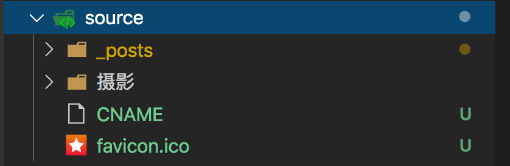

<!-- more -->

>本项目基于hexo+github结构创建

## 1 配置环境

### 1.1 Node

用来生成静态页面的，到Node.js[官网](https://nodejs.org/en/)下载相应平台的最新版本，一路安装即可。

### 1.2 Git

把本地的hexo内容提交到github上去。安装Xcode就自带有Git，我就不多说了。

* 注意：这里如果是首次生成ssh的话可能有个小坑 下文2.2中会提到

### 1.3 申请GitHub

是用来做博客的远程创库、域名、服务器之类的，怎么与本地hexo建立连接等下讲。
github账号我也不再啰嗦了,没有的话直接申请就行了，跟一般的注册账号差不多，
SSH Keys，看你自己了，可以不配制，不配置的话以后每次对自己的博客有改动提交的时候就要手动输入账号密码，
配置了就不需要了，怎么配置我就不多说了，网上有很多教程。

### 1.4 正式安装HEXO

Node和Git都安装好后，可执行如下命令安装hexo：

```shell
sudo npm install -g hexo
```

### 1.5 初始化hexo

创建一个文件夹，如：Blog，cd到Blog里执行hexo init的。命令

```shell
hexo init
```

好啦，至此，全部安装工作已经完成！

### 1.6 生成静态页面

继续再Blog目录下执行如下命令，生成静态页面

```shell
hexo generate（hexo g也可以）
```

### 1.7 本地启动

启动本地服务，进行文章预览调试

```shell
hexo server
```

浏览器输入[http://localhost:4000](http://localhost:4000) 这里可能遇到无法启动的问题，可能是环境未配置好

### 1.8 常见的HEXO配置错误

```shell
ERROR Plugin load failed: hexo-server

原因： Besides, utilities are separated into a standalone module. hexo.util is not reachable anymore.

解决方法，执行命令：$ sudo npm install hexo-server
```

```shell
执行命令hexo server，提示：Usage: hexo<Command> ....

原因：我认为是没有生成本地服务

解决方法，执行命令：$ npm install hexo-server --save

提示：hexo-server@0.1.2 node_modules/hexo-server
....

表示成功了[参考](https://hexo.io/zh-cn/docs/server.html)
```

这个时候再执行：hexo-server

得到: INFO Hexo is running at http://0.0.0.0:4000/. Press Ctrl+C to stop.

这个时候再点击http://0.0.0.0:4000，正常情况下应该是最原始的画面，但是我看到的是：
白板和Cannot GET / 几个字 原因： 由于2.6以后就更新了，我们需要手动配置些东西，我们需要输入下面三行命令：

```shell
npm install hexo-renderer-ejs --save
npm install hexo-renderer-stylus --save
npm install hexo-renderer-marked --save
```

这个时候再重新生成静态文件，命令：

```shell
hexo generate （或hexo g）
```

启动本地服务器：

```shell
hexo server （或hexo s）
```

再点击网址http://0.0.0.0:4000 OK终于可以看到属于你自己的blog啦，虽然很简陋，但好歹有了一个属于自己的小窝了。
[参考链接](https://blog.gaotianyang.top/)，本地已经简单的设置好了，但是现在域名和服务器都是基于自己的电脑，接下来需要跟github进行关联。

## 2 配置Github

### 2.1 在github上创建仓库，并clone至本地

* 注意：建立与你用户名对应的仓库，仓库名必须为【your_user_name.github.io】，固定写法
例如：【mitudegaoyang.github.io】

### 2.2 将Hexo全部内容复制进上一步创建的文件夹中，并提交仓库

* 注意：这里如果是第一次提交至GitHub仓库 可能遇到如下的问题

在初始化git之后（git init），同时在github建立好仓库之后，
本地也新增了ssh kye（ssh-keygen -t rsa -C ‘mail address’），
同时也在本地新增了远程仓库（git remote add origin github地址）， 
但是在git push的时候出现错误

```shell
The authenticity of host ‘github.com (192.30.255.112)’ can’t be established.
RSA key fingerprint is SHA256:nThbg6kXUpJWGl7E1IGOCspRomTxdCARLviKw6E5SY8.
Are you sure you want to continue connecting (yes/no)?
```

这里你直接回车的话会出现验证失败

```shell
Host key verification failed.
fatal: Could not read from remote repository.
```

验证失败。谷歌了一下，原来是本地少了 know_host文件，只要在刚刚那个位置输入yes就可以了，而不是回车（回车惯了）

### 2.3 配置HEXO配置文件 关联仓库

现在我们需要_config.yml文件，来建立关联

翻到最下面，改成我这样子的

```shell
deploy:

     type: git

     repo: git@github.com:mitudegaoyang/mitudegaoyang.github.io.git

     branch: master
```

然后执行命令：

```shell
npm install hexo-deployer-git --save
```

* 注意：网上会有很多说法，有的type是github, 还有repository最后面的后缀也不一样，
是github.com.git，我也踩了很多坑，我现在的版本是hexo: 3.1.1，执行命令hexo -vsersion就出来了,
貌似3.0后全部改成我上面这种格式了。

* 忘了说了，我没用SSH Keys如果你用了SSH Keys的话直接在github里复制SSH的就行了，总共就两种协议，相信你懂的。

### 2.4 执行配置命令

```shell
hexo deploy
```

然后再浏览器中输入http://mitudegaoyang.github.io/就行了，我的github的账户叫mitudegaoyang,把这个改成你github的账户名就行了

### 2.5 部署步骤

每次部署的步骤，可按以下三步来进行。

```shell
hexo clean

hexo generate

hexo deploy
```

### 2.6. 一些常用命令

```shell
hexo new "postName" #新建文章

hexo new page "pageName" #新建页面

hexo generate #生成静态页面至public目录

hexo server #开启预览访问端口（默认端口4000，'ctrl + c'关闭server）

hexo deploy #将.deploy目录部署到GitHub

hexo help # 查看帮助

hexo version #查看Hexo的版本
```

### 2.7 主题安装

#### 安装

```shell
git clone https://github.com/litten/hexo-theme-yilia.git themes/yilia
```

#### 配置使用yilia

```shell
修改hexo根目录下的 _config.yml ： theme: yilia
```

#### 更新

```shell
cd themes/yilia
git pull
```

#### 配置yilia主题

主题配置文件在主目录下的_config.yml，请根据自己需要修改使用

* 注意：如果是已经修改了主题，并需要多电脑同步主题的话，则需要将主题打包发送至另一台电脑。
因为主题本身是从github上clone下来的，因此存在.git管理文件。不可以和hexo一同上传至自己的仓库进行托管。
如果只是较为简单的配置。可以将配置文件放置在`source/_data/`目录下进行代码管理。

```yml
# Header

menu:
  主页: /
  随笔: /tags/随笔/
  相册: /tags/相册/
  摄影: /摄影/

# SubNav
subnav:
  github: "https://github.com/mitudegaoyang"
  #weibo: "#"
  #rss: "#"
  #zhihu: "#"
  #qq: "#"
  weixin: "/img/timg.jpeg"
  #jianshu: "#"
  #douban: "#"
  #segmentfault: "#"
  #bilibili: "#"
  #acfun: "#"
  mail: "mailto:13683265113@163.com"
  facebook: "https://www.gitbook.com/@mitudegaoyang"
  #google: "#"
  #twitter: "#"
  #linkedin: "#"

rss: /atom.xml

# 是否需要修改 root 路径
# 如果您的网站存放在子目录中，例如 http://yoursite.com/blog，
# 请将您的 url 设为 http://yoursite.com/blog 并把 root 设为 /blog/。
root:

# Content

# 文章太长，截断按钮文字
excerpt_link: more
# 文章卡片右下角常驻链接，不需要请设置为false
show_all_link: '展开全文'
# 数学公式
mathjax: false
# 是否在新窗口打开链接
open_in_new: false

# 打赏
# 打赏type设定：0-关闭打赏； 1-文章对应的md文件里有reward:true属性，才有打赏； 2-所有文章均有打赏
reward_type: 2
# 打赏wording
reward_wording: '谢谢你请我吃糖果'
# 支付宝二维码图片地址，跟你设置头像的方式一样。比如：/assets/img/alipay.jpg
alipay:
# 微信二维码图片地址
weixin:

# 目录
# 目录设定：0-不显示目录； 1-文章对应的md文件里有toc:true属性，才有目录； 2-所有文章均显示目录
toc: 1
# 根据自己的习惯来设置，如果你的目录标题习惯有标号，置为true即可隐藏hexo重复的序号；否则置为false
toc_hide_index: true
# 目录为空时的提示
toc_empty_wording: '目录，不存在的…'

# 是否有快速回到顶部的按钮
top: true

# Miscellaneous
baidu_analytics: ''
google_analytics: ''
favicon: /favicon.ico

#你的头像url
avatar: /img/timg.jpeg

#是否开启分享
share_jia: true

#评论：1、多说；2、网易云跟帖；3、畅言；4、Disqus；5、Gitment
#不需要使用某项，直接设置值为false，或注释掉
#具体请参考wiki：https://github.com/litten/hexo-theme-yilia/wiki/

#1、多说
duoshuo: false

#2、网易云跟帖
wangyiyun: false

#3、畅言
changyan_appid: false
changyan_conf: false

#4、Disqus 在hexo根目录的config里也有disqus_shortname字段，优先使用yilia的
disqus: false

#5、Gitment
gitment_owner: false      #你的 GitHub ID
gitment_repo: ''          #存储评论的 repo
gitment_oauth:
  client_id: ''           #client ID
  client_secret: ''       #client secret

# 样式定制 - 一般不需要修改，除非有很强的定制欲望…
style:
  # 头像上面的背景颜色
  header: '#4d4d4d'
  # 右滑板块背景
  slider: 'linear-gradient(200deg,#a0cfe4,#e8c37e)'

# slider的设置
slider:
  # 是否默认展开tags板块
  showTags: false

# 智能菜单
# 如不需要，将该对应项置为false
# 比如
#smart_menu:
#  friends: false
smart_menu:
  innerArchive: '所有文章'
  friends: '友链'
  aboutme: '关于我'

friends:
  github: https://github.com/mitudegaoyang
  gitbook: https://www.gitbook.com/@mitudegaoyang
  个人简历: https://www.gaotianyang.top/
  个人博客: https://blog.gaotianyang.top/
  个人博客: https://blog.gaotianyang.top/
  网站demo: https://mitudegaoyang.github.io/kuaiyijian/

aboutme: 知言善行笃学慎思
```

## 3 其他

### 3.1 常见主题

这里有大量的[主题列表](https://github.com/hexojs/hexo/wiki/Themes)使用方法里面 都有详细的介绍，我就不多说了。
我这里有几款个人认为不错的主题，免去你们，一个一个的选了，欢迎吐槽我的审美

* Cover - A chic theme with facebook-like cover photo
* Oishi - A white theme based on Landscape plus and Writing.
* Sidebar - Another theme based on Light with a simple sidebar
* TKL - A responsive design theme for Hexo. 一个设计优雅的响应式主题
* Tinnypp - A clean, simple theme based on Tinny
* Writing - A small and simple hexo theme based on Light
* Yilia - Responsive and simple style 优雅简洁响应式主题，我用得就是这个。
* Pacman voidy - A theme with dynamic tagcloud and dynamic snow

### 3.2 hexo部署后，CNAME会被自动删除

将需要上传至github的内容放在source文件夹，例如CNAME、favicon.ico、images等



### 3.3 hexo的多分支管理

在实际使用的过程中，如果只有master分支进行blog管理会存在一些不便的问题。
因为GitHub Pages默认是对master分支进行展示的，因此在我们执行`hexo deploy`的时候，
hexo会将处理后的静态文件推至远端的master分支。

当本地也在master分支进行博客的编写工作时，会导致Hexo项目里的Markdown文件和图片无法推送到master分支(因为文件冲突)。
这时候选择多分支进行管理，就可以解决这个问题了。

这不仅仅解决了Hexo项目里的Markdown文件和图片的版本控制，还可以使得我们同时在多个机器上编写博客。

mitudegaoyang.github.io仓库中，博客的静态页面放在master分支上，而Markdown文件放在hexo分支上，
两个分支互相之间不会进行合并。本机写博客的时候，就在hexo分支下写Markdown文件，
使用Hexo生成静态页面后，部署到远程（GitHub上）的master分支。而博客源文件在hexo分支管理后，
和远程的hexo分支进行同步。本地从来不处理master分支。这样两个分支就可以相安无事地共同呆在一个仓库里了。

### 3.4 其他报错总结

```shell
ERROR Deployer not found: git 或者 ERROR Deployer not found: github
```

解决方法

```shell
npm install hexo-deployer-git --save
```

如发生报错： ERROR Process failed: layout/.DS_Store , 那么进入主题里面layout和_partial目录下，使用删除命令：

```shell
rm-rf.DS_Store
```

## 参考资料

* [HEXO+Github,搭建属于自己的博客](http://www.jianshu.com/p/465830080ea9)
* [The authenticity of host 'github.com...](https://blog.csdn.net/taoerchun/article/details/94349910)
* [HEXO主题推荐](https://www.zhihu.com/question/24422335)
* [hexo部署后，CNAME会被自动删除](https://www.zhihu.com/question/28814437)
* [Hexo博客的多分支管理方法](http://nettee.github.io/posts/2016/Two-Branch-Managing-Blog/)
* [Hexo使用theme/next主题部分无法推送github远程仓库](https://www.dazhuanlan.com/2019/12/31/5e0b2151a8260/)
* [主题hexo-theme-yilia安装](https://github.com/litten/hexo-theme-yilia)
